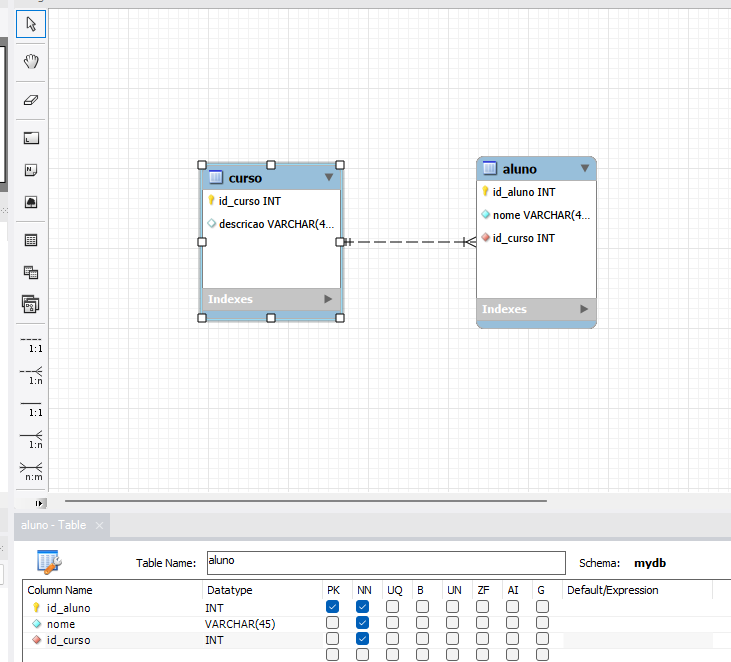

## Aqui a foto das tabelas:



## O código gerado:

````-- MySQL Workbench Forward Engineering

SET @OLD_UNIQUE_CHECKS=@@UNIQUE_CHECKS, UNIQUE_CHECKS=0;
SET @OLD_FOREIGN_KEY_CHECKS=@@FOREIGN_KEY_CHECKS, FOREIGN_KEY_CHECKS=0;
SET @OLD_SQL_MODE=@@SQL_MODE, SQL_MODE='ONLY_FULL_GROUP_BY,STRICT_TRANS_TABLES,NO_ZERO_IN_DATE,NO_ZERO_DATE,ERROR_FOR_DIVISION_BY_ZERO,NO_ENGINE_SUBSTITUTION';

-- -----------------------------------------------------
-- Schema mydb
-- -----------------------------------------------------

-- -----------------------------------------------------
-- Schema mydb
-- -----------------------------------------------------
CREATE SCHEMA IF NOT EXISTS `mydb` DEFAULT CHARACTER SET utf8 ;
USE `mydb` ;

-- -----------------------------------------------------
-- Table `mydb`.`curso`
-- -----------------------------------------------------
CREATE TABLE IF NOT EXISTS `mydb`.`curso` (
  `id_curso` INT NOT NULL,
  `descricao` VARCHAR(45) NULL,
  PRIMARY KEY (`id_curso`))
ENGINE = InnoDB;


-- -----------------------------------------------------
-- Table `mydb`.`aluno`
-- -----------------------------------------------------
CREATE TABLE IF NOT EXISTS `mydb`.`aluno` (
  `id_aluno` INT NOT NULL,
  `nome` VARCHAR(45) NOT NULL,
  `id_curso` INT NOT NULL,
  PRIMARY KEY (`id_aluno`),
  INDEX `fk_aluno_curso_idx` (`id_curso` ASC) VISIBLE,
  CONSTRAINT `fk_aluno_curso`
    FOREIGN KEY (`id_curso`)
    REFERENCES `mydb`.`curso` (`id_curso`)
    ON DELETE NO ACTION
    ON UPDATE NO ACTION)
ENGINE = InnoDB;


SET SQL_MODE=@OLD_SQL_MODE;
SET FOREIGN_KEY_CHECKS=@OLD_FOREIGN_KEY_CHECKS;
SET UNIQUE_CHECKS=@OLD_UNIQUE_CHECKS;````
