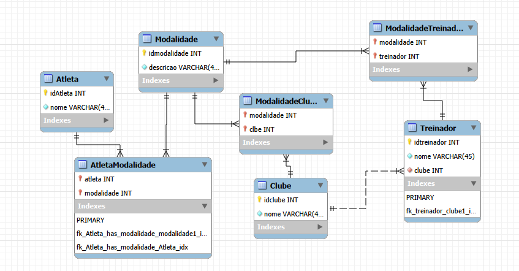

# Esquema de Tabelas — Clube de Esportes

## Diagrama



---

## Código MySQL

### Configurações Iniciais

```sql
SET @OLD_UNIQUE_CHECKS=@@UNIQUE_CHECKS, UNIQUE_CHECKS=0;
SET @OLD_FOREIGN_KEY_CHECKS=@@FOREIGN_KEY_CHECKS, FOREIGN_KEY_CHECKS=0;
SET @OLD_SQL_MODE=@@SQL_MODE, SQL_MODE='ONLY_FULL_GROUP_BY,STRICT_TRANS_TABLES,NO_ZERO_IN_DATE,NO_ZERO_DATE,ERROR_FOR_DIVISION_BY_ZERO,NO_ENGINE_SUBSTITUTION';
```

---

### Schema

```sql
CREATE SCHEMA IF NOT EXISTS `mydb` DEFAULT CHARACTER SET utf8 ;
USE `mydb` ;
```

---

### Tabelas

#### `Atleta`

```sql
CREATE TABLE IF NOT EXISTS `mydb`.`Atleta` (
  `idAtleta` INT NOT NULL AUTO_INCREMENT,
  `nome` VARCHAR(45) NOT NULL,
  PRIMARY KEY (`idAtleta`))
ENGINE = InnoDB;
```

---

#### `Modalidade`

```sql
CREATE TABLE IF NOT EXISTS `mydb`.`Modalidade` (
  `idmodalidade` INT NOT NULL AUTO_INCREMENT,
  `descricao` VARCHAR(45) NOT NULL,
  PRIMARY KEY (`idmodalidade`))
ENGINE = InnoDB;
```

---

#### `Clube`

```sql
CREATE TABLE IF NOT EXISTS `mydb`.`Clube` (
  `idclube` INT NOT NULL AUTO_INCREMENT,
  `nome` VARCHAR(45) NOT NULL,
  PRIMARY KEY (`idclube`))
ENGINE = InnoDB;
```

---

#### `Treinador`

```sql
CREATE TABLE IF NOT EXISTS `mydb`.`Treinador` (
  `idtreinador` INT NOT NULL AUTO_INCREMENT,
  `nome` VARCHAR(45) NOT NULL,
  `clube` INT NOT NULL,
  PRIMARY KEY (`idtreinador`),
  INDEX `fk_treinador_clube1_idx` (`clube` ASC) VISIBLE,
  CONSTRAINT `fk_treinador_clube1`
    FOREIGN KEY (`clube`)
    REFERENCES `mydb`.`Clube` (`idclube`)
    ON DELETE NO ACTION
    ON UPDATE NO ACTION)
ENGINE = InnoDB;
```

---

### Tabelas de Relacionamento (N:N)

#### `AtletaModalidade`

> Relaciona **Atleta** ↔ **Modalidade**

```sql
CREATE TABLE IF NOT EXISTS `mydb`.`AtletaModalidade` (
  `atleta` INT NOT NULL,
  `modalidade` INT NOT NULL,
  PRIMARY KEY (`atleta`, `modalidade`),
  INDEX `fk_Atleta_has_modalidade_modalidade1_idx` (`modalidade` ASC) VISIBLE,
  INDEX `fk_Atleta_has_modalidade_Atleta_idx` (`atleta` ASC) VISIBLE,
  CONSTRAINT `fk_Atleta_has_modalidade_Atleta`
    FOREIGN KEY (`atleta`)
    REFERENCES `mydb`.`Atleta` (`idAtleta`)
    ON DELETE NO ACTION
    ON UPDATE NO ACTION,
  CONSTRAINT `fk_Atleta_has_modalidade_modalidade1`
    FOREIGN KEY (`modalidade`)
    REFERENCES `mydb`.`Modalidade` (`idmodalidade`)
    ON DELETE NO ACTION
    ON UPDATE NO ACTION)
ENGINE = InnoDB;
```

---

#### `ModalidadeTreinador`

> Relaciona **Modalidade** ↔ **Treinador**

```sql
CREATE TABLE IF NOT EXISTS `mydb`.`ModalidadeTreinador` (
  `modalidade` INT NOT NULL,
  `treinador` INT NOT NULL,
  PRIMARY KEY (`modalidade`, `treinador`),
  INDEX `fk_modalidade_has_treinador_treinador1_idx` (`treinador` ASC) VISIBLE,
  INDEX `fk_modalidade_has_treinador_modalidade1_idx` (`modalidade` ASC) VISIBLE,
  CONSTRAINT `fk_modalidade_has_treinador_modalidade1`
    FOREIGN KEY (`modalidade`)
    REFERENCES `mydb`.`Modalidade` (`idmodalidade`)
    ON DELETE NO ACTION
    ON UPDATE NO ACTION,
  CONSTRAINT `fk_modalidade_has_treinador_treinador1`
    FOREIGN KEY (`treinador`)
    REFERENCES `mydb`.`Treinador` (`idtreinador`)
    ON DELETE NO ACTION
    ON UPDATE NO ACTION)
ENGINE = InnoDB;
```

---

#### `ModalidadeClube`

> Relaciona **Modalidade** ↔ **Clube**

```sql
CREATE TABLE IF NOT EXISTS `mydb`.`ModalidadeClube` (
  `modalidade` INT NOT NULL,
  `clbe` INT NOT NULL,
  PRIMARY KEY (`modalidade`, `clbe`),
  INDEX `fk_modalidade_has_clube_clube1_idx` (`clbe` ASC) VISIBLE,
  INDEX `fk_modalidade_has_clube_modalidade1_idx` (`modalidade` ASC) VISIBLE,
  CONSTRAINT `fk_modalidade_has_clube_modalidade1`
    FOREIGN KEY (`modalidade`)
    REFERENCES `mydb`.`Modalidade` (`idmodalidade`)
    ON DELETE NO ACTION
    ON UPDATE NO ACTION,
  CONSTRAINT `fk_modalidade_has_clube_clube1`
    FOREIGN KEY (`clbe`)
    REFERENCES `mydb`.`Clube` (`idclube`)
    ON DELETE NO ACTION
    ON UPDATE NO ACTION)
ENGINE = InnoDB;
```

---

### Restauração das Configurações

```sql
SET SQL_MODE=@OLD_SQL_MODE;
SET FOREIGN_KEY_CHECKS=@OLD_FOREIGN_KEY_CHECKS;
SET UNIQUE_CHECKS=@OLD_UNIQUE_CHECKS;
```
