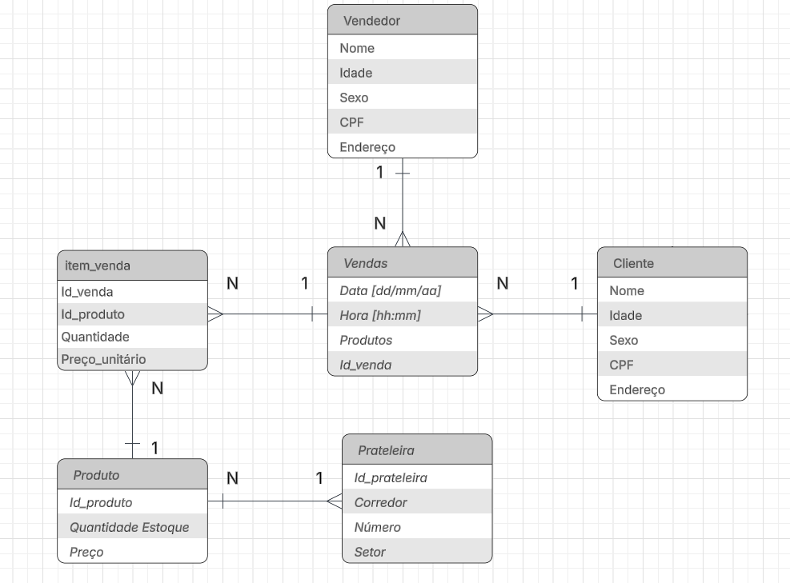

# Exercício – Identificar entidades

- Deseja-se construir um banco de dados para um sistema de vendas. Em cada venda são vendidos vários produtos e um determinado produto pode aparecer em diferentes vendas. Cada venda é efetuada por um vendedor para um determinado cliente. Um produto está armazenado em uma prateleira.

- Exercício resolvido:

