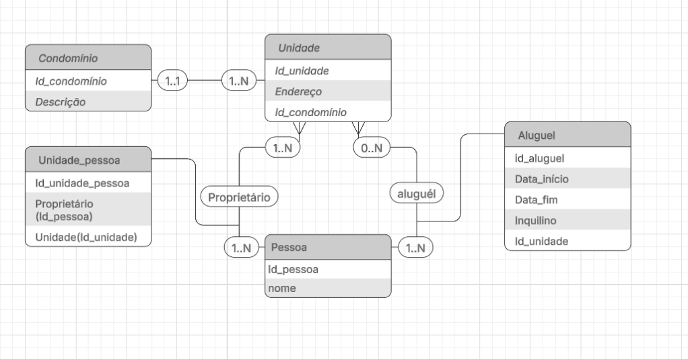

# Administradora de imóveis

- A administradora trabalha tanto com administração de condomínios, quanto com a administração de aluguéis.
Uma entrevista com o gerente da administradora resultou nas seguintes informações:

    * A administradora administra condomínios formados por unidades condominiais.
    * Cada unidade condominial é de propriedade de uma ou mais pessoas. Uma pessoa pode possuir diversas unidades. Cada unidade pode estar alugada para no máximo uma pessoa. Uma pessoa pode alugar diversas unidades.

- Exercício resolvido:

 